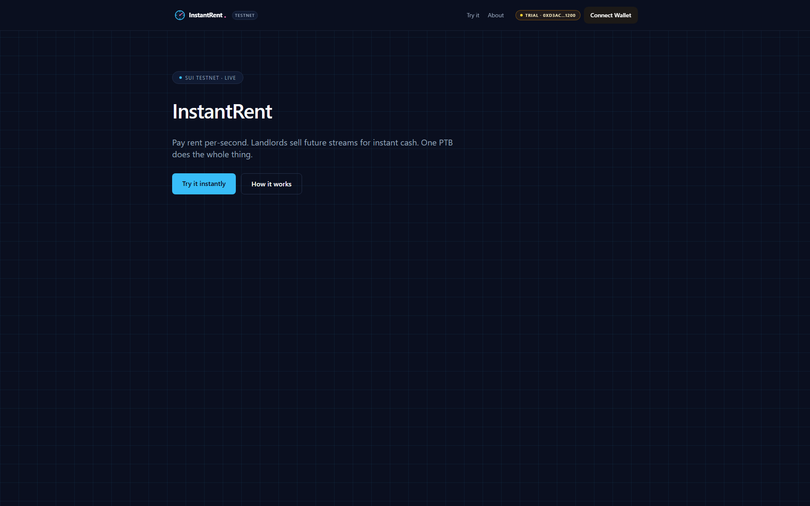
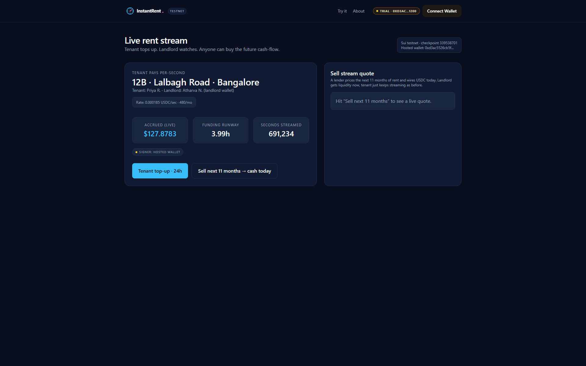

<p align="center">
  
</p>

<p align="center">
  <b>InstantRent</b> — Per-second SUI rentals — streams, not deposits.
</p>

<p align="center">
  <a href="https://instantrent.veithly.workers.dev"></a>
  <a href="https://instantrent.veithly.workers.dev/app"></a>
  <a href="https://nextjs.org"></a>
  <a href="https://sui.io"></a>
  <a href="./LICENSE"></a>
</p>

<p align="center">
  
</p>

## Why InstantRent

Renting anything online today means a fat deposit, a credit-card hold, and a refund that arrives a week later. InstantRent inverts the model. Pick the asset, set a per-second rate, hit Start. SUI streams from the renter's wallet to the owner's wallet every block. Pause any time. Stop any time. Refunds happen in the same PTB the stop triggers — no chargeback, no escrow custody, no Stripe round-trip.

## What it does

Open the app. A storefront of rentable assets renders — bikes, drones, GPUs, hotel rooms — each priced in SUI per second with a stream meter and an availability ribbon. Pick one. Click Rent. The trial wallet path streams from a sponsor wallet; the connect path streams from your own. Sign one PTB.

A live counter starts ticking — every second a fraction of SUI lands in the owner's wallet. Pause at any moment to freeze the stream. Stop at any moment to refund the remaining balance and burn the rental object. Watch the digest panel: each pause, resume, and stop produces a real Sui Testnet PTB you can click through.

<p align="center">
  
</p>

## Architecture

Next.js 15 + Mysten dApp Kit. A `Stream` shared object holds rate + last-payment timestamp; `step(stream)` pulls the elapsed seconds into a Coin<SUI> split. The keeper hits `step` once per minute as a fallback so streams settle even if no party clicks. Full architecture in [`docs/ARCHITECTURE.md`](./docs/ARCHITECTURE.md).

## Quick start

```bash
pnpm install
cp .env.example .env.local   # fill SUI_FULLNODE_URL + LLM key (see below)
pnpm dev                     # http://localhost:3120
```

Required env vars:
- `SUI_FULLNODE_URL` — Sui Testnet RPC endpoint (default: `https://fullnode.testnet.sui.io:443`)
- `SUI_DEMO_PRIVATE_KEY` — Ed25519 secret key for the hosted-wallet ("Try instantly") flow. Leave blank to require a connected wallet.
- `STEPFUN_API_KEY` (or `OPENAI_API_KEY`) — reasoning engine key, only required for the AI-driven flows.

Production build + Cloudflare deploy:

```bash
pnpm build
pnpm run deploy   # opennextjs-cloudflare deploy
```

End-to-end smoke test:

```bash
pnpm test:e2e
```

## Tech stack

- **Next.js 15** App Router · React 19 · Tailwind v4 · shadcn/ui base
- **@mysten/dapp-kit-react** for wallet connection + transaction signing
- **@mysten/sui** for PTB construction + RPC
- **OpenNext** for Cloudflare Workers deployment
- **Playwright** for end-to-end test coverage

## License

MIT © veithly
