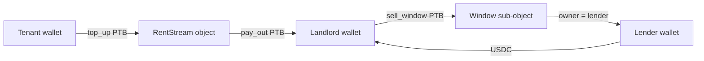

# InstantRent

### Pay rent by the second. On Sui.

*Renters top up when their invoices clear. Landlords sell future streams to a lender — instantly, in one PTB.*

[](https://instantrent.vercel.app/app)
[](https://suivision.xyz/?network=testnet)
[](#how-it-works)
[](./LICENSE)

**Quick links:**
[App](https://instantrent.vercel.app/app) ·
[Architecture](./docs/ARCHITECTURE.md) ·
[Move package](./move/sources/)

---

## Why InstantRent is different

| | Cash / wire | Credit card | Bank loan | **InstantRent** |
| --- | --- | --- | --- | --- |
| Tenant cost | 0 + overdraft | 18-29% APR | n/a | **0** |
| Landlord cost | wait 30 days | n/a | 8% APR | **0-3% spread** |
| Liquidity speed | 1-3 days | instant | 5-14 days | **One PTB** |
| Trust | bank | issuer | bank | **Sui object** |

## How it works



## Hero moment

```
0:00  Diana clicks Sell next 14 days
0:01  Quote: $648 now ↔ $700 streamed
0:02  One PTB
0:03  USDC lands in Diana's wallet
0:05  Stream pointer flips to lender for 14 days
```

## Quick start (developer)

```bash
pnpm install
cp .env.example .env.local
# Optional: set SUI_DEMO_PRIVATE_KEY to enable the hosted-wallet flow.
pnpm dev               # http://localhost:3120
pnpm test:e2e          # Playwright smoke
pnpm build             # production build
```

### Status

- Next.js 15 + Sui dApp Kit; `pnpm build` clean.
- Live per-second accrual ticker on `/app` (chain-anchored).
- `POST /api/streams/top-up` extends funding runway; fires a real PTB with a configured signer, dry-run otherwise.
- `POST /api/streams/sell` returns a deterministic lender quote (7% discount p.a. + 1% spread).
- Move package `instantrent_core` source under `sources/`, ready to publish.

## License
MIT.
