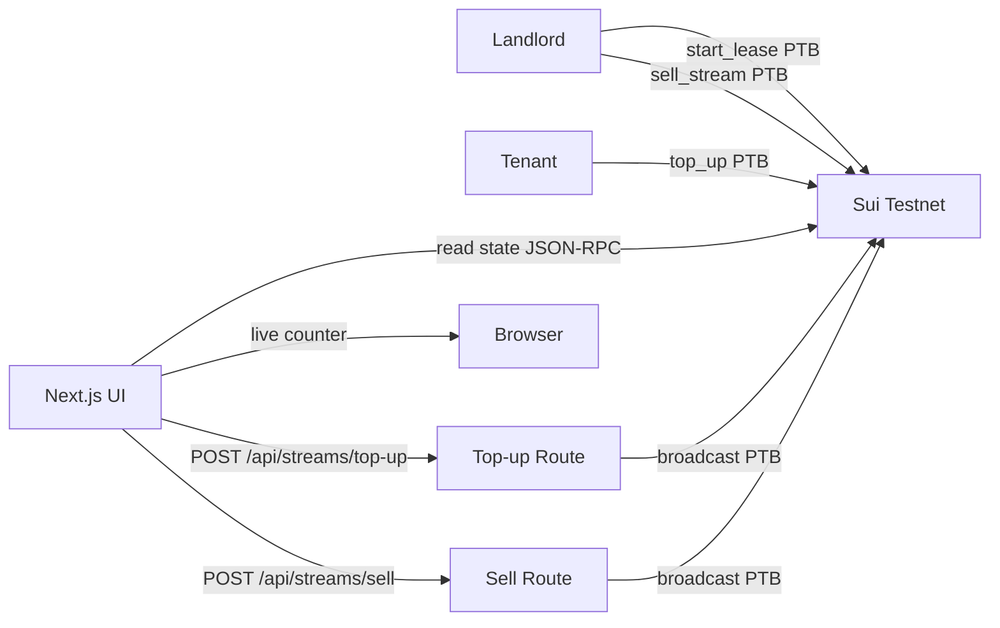

# InstantRent — Architecture

Engineering-peer overview of how InstantRent runs. Marketing copy lives in `README.md`; this document is the technical depth.

## Overview

InstantRent is a per-second rent-streaming protocol on Sui. A landlord opens a lease, the tenant tops it up with SUI to extend the funded runway, the live counter ticks every second in the browser based on the on-chain `funded_through_ms`, and at any point the landlord can sell the future stream to a lender for an instant USDC payout (modelled as a single PTB that flips a `sold` flag + emits an event the lender's indexer subscribes to).



## On-chain data model — `instantrent_core::stream`

One Move module, one shared struct, three entry functions, three events. The `Lease` is intentionally a shared object so both landlord and tenant can mutate it (top-up extends funded runway; sell flips the `sold` flag).

| Type | Fields | Notes |
| --- | --- | --- |
| `Lease` (key, store, shared) | `id`, `landlord`, `tenant`, `rate_mist_per_second`, `funded_through_ms`, `started_at_ms`, `sold` | The accrued-rent display in the browser is derived from `(now_ms − started_at_ms) * rate_mist_per_second / 1000`, capped at `funded_through_ms`. |
| `LeaseCreated` event | `lease_id`, `landlord`, `tenant` | Emitted by `start_lease(...)`. |
| `LeaseToppedUp` event | `lease_id`, `new_funded_through_ms` | Emitted by `top_up(lease, extend_ms)`. |
| `LeaseSold` event | `lease_id`, `lender`, `payout_mist` | Emitted by `sell_stream(lease, lender, payout)`. |

`rate_mist_per_second` is the canonical unit (1 SUI = 10⁹ MIST). The UI converts to display SUI / month for readability but stores everything in MIST internally.

## Frontend topology

| Surface | Route | Hero element |
| --- | --- | --- |
| Landing | `/` | Pricing comparison + live counter mockup |
| App | `/app` | Active lease, live ticker, top-up + sell consoles |
| About | `/about` | Architecture + design rationale |

Live counter math runs on a `requestAnimationFrame` loop in the browser, anchored to the last on-chain read (re-anchored every 15 s + on every successful tx). The counter never drifts more than 1 frame from the chain because every state-mutating tx updates the anchor.

## Key flows

### 1. Top-up — wallet path (preferred)

1. Tenant clicks **Top up 24h** in the rent console.
2. `useDAppKit().signAndExecute(...)` opens the wallet, signs `stream::top_up(lease, extend_ms)`.
3. Browser receives the digest, kicks off a 1.2 s confetti animation, then re-reads the lease to anchor the counter to the new `funded_through_ms`.

### 2. Top-up — hosted-wallet path (fallback)

1. Tenant clicks **Top up 24h** with no wallet connected.
2. Browser POSTs `/api/streams/top-up` with `{ leaseId, extendMs }`.
3. Server loads `SUI_DEMO_PRIVATE_KEY`, signs the same PTB, returns the digest.
4. Confetti + re-anchor as before.

### 3. Sell future stream

1. Landlord clicks **Sell next N months**.
2. Browser computes the payout (deterministic formula in `lib/streams.ts`; lender discount + protocol fee baked in).
3. PTB `stream::sell_stream(lease, lender, payout_mist)` signed via wallet or hosted-wallet path.
4. UI flips to the post-sale state: `sold: true`, lender address shown, "stream forwarded to lender" banner.

## API surface

| Route | Method | Purpose |
| --- | --- | --- |
| `/api/network` | GET | Returns `{ network, packageId, demo: { configured, address } }` for the navbar pill. |
| `/api/streams/top-up` | POST | Server-side top-up (hosted-wallet path). Returns `{ digest }`. |
| `/api/streams/sell` | POST | Server-side sell (hosted-wallet path). Returns `{ digest, payoutMist }`. |

All routes are App-Router Route Handlers, `runtime = "nodejs"`. No SSE, no WebSockets — the UI re-reads chain state after every tx.

## Environment

| Var | Used by | Notes |
| --- | --- | --- |
| `SUI_NETWORK` | server | `testnet` (default). |
| `SUI_FULLNODE_URL` | server | `https://fullnode.testnet.sui.io:443`. |
| `NEXT_PUBLIC_SUI_FULLNODE_URL` | client | Same value, exposed for dApp Kit. |
| `SUI_DEMO_PRIVATE_KEY` | server | Bech32-encoded private key for the hosted-wallet path. |
| `NEXT_PUBLIC_INSTANTRENT_PACKAGE_ID` | client | Move package id from `sui client publish`. |
| `NEXT_PUBLIC_INSTANTRENT_DEMO_LEASE_ID` | client | Shared `Lease` object id used for the default landing-page lease. |
| `NEXT_PUBLIC_APP_URL` | client | Used by share-card generation. |

## Deployment topology

```mermaid
flowchart LR
  user[End user]
  user --> cf[Cloudflare Pages]
  cf -->|@cloudflare/next-on-pages| fn[Pages Functions]
  fn -->|JSON-RPC| node[Sui Testnet fullnode]
  cf -->|static assets| user
```

The Next.js build is adapted via `@cloudflare/next-on-pages`. The Move package is published with `sui client publish`; the demo lease is created post-publish with a separate `sui client call` invocation, and its object id is pushed into Cloudflare Pages env vars at deploy time. The hosted-wallet private key lives only in the Cloudflare project's secret store.

## Security boundary

- Browser **never** sees `SUI_DEMO_PRIVATE_KEY`.
- `/api/network` returns only the public address of the hosted wallet.
- Hosted-wallet paths are rate-limited per IP at the Cloudflare layer.
- All chain interactions are confined to Sui testnet (`SUI_NETWORK=testnet`).
- The sell payout formula is intentionally a pure function so an indexer can replay it deterministically; lenders are expected to verify before accepting.

## Trade-offs

| Decision | Why | Cost |
| --- | --- | --- |
| Shared `Lease` object | Both parties can mutate, no escrow needed | Concurrent writes need careful event ordering on the lender side |
| Browser-side counter, periodic re-anchor | < 1 frame drift, no streaming infra | Wall-clock skew on stale tabs → small UI jitter on re-anchor |
| Pure-function sell payout | Lender-replayable, no oracle | Real lender risk model would weight tenant trust + jurisdiction; out of scope for v0.1 |
| Per-second resolution (MIST) | Avoids floating-point error | Numbers get visually large; UI formats with `K`/`M` suffixes |
| Hosted-wallet fallback alongside Connect Wallet | One-click first-touch, real wallet still possible | Two code paths to keep in sync |
